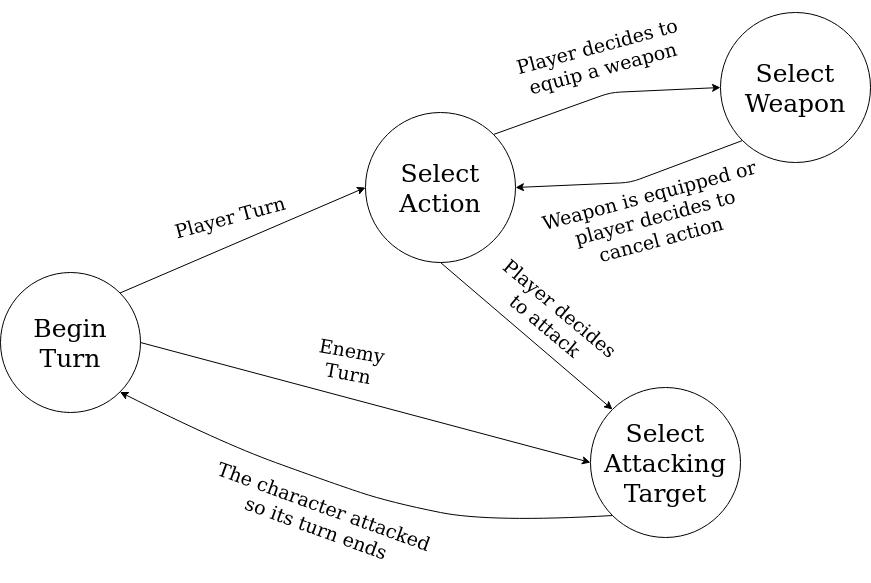

Final Reality
=============


This work is licensed under a 
[Creative Commons Attribution 4.0 International License](http://creativecommons.org/licenses/by/4.0/)

Context
-------

This project's goal is to create a (simplified) clone of _Final Fantasy_'s combat, a game developed
by [_Square Enix_](https://www.square-enix.com)
Broadly speaking for the combat the player has a group of characters to control and a group of 
enemies controlled by the computer.

How to run the game
---
To run this project please compile it using a Java Virtual Machine first and then run the FinalReality class. 
*The game does nothing for now as it is in development*

Assumptions
---
- The code assumes that the playable characters have a base weight of 10.
- It also assumes that there is only one type of enemy (*Although is open to add different classes*)
- The thief class can equip swords, knifes, and bows.
- Each character has a base attack, base defense, base weight. The weapons stats add
to that base.

The Code's Logic
---
This game is programmed using Object Oriented Programming. It has characters and weapons that
only playable characters may equip.

Every character has the same base behavior, so they all inherit from the same
abstract class and interface. This is also applicable for the weapons.

Playable characters differ from enemies because the player can equip and use weapons.
This is why the playable characters have their own interface and abstract class.

The player's characters have different classes and so here comes another fork between the objects.
There are **Common** characters and **Mage** characters. The mages have the same behaviour as the common
except for the fact that mages can use spells and have mana.

This is why mages have their own interface and abstract class. With this said the **Staff**
weapon is different from the other weapons because it has *magic damage*. But since it is a
particular case it doesn't have another abstract class or interface of its own.

To implement the attack and equip a weapon of a character the **double dispatch**
technique is used. This is done by implementing an *attack* and *defend* method
on each character. Also, every playable character has an *equip* method that
messages a weapon what class it's trying to equip that weapon. And finally every 
weapon has a method that can answer accordingly (all the equipTo*Class* methods)

### Controler
For events and the game controller, design patterns are used. Mainly the Observer pattern is used for
the events of a character dying or a character beginning its turn.

IEventHandler is the interface used to group every handler. This are `EnemyDeadHandler`,
`EnemyTurnHandler`, `PlayerCharacterDeadHandler` and `PlayerCharacterTurnHandler`.

`EnemyDeadHandler` and `PlayerCharacterDeadHandler` are observer for the event of a character dying. Since
there are two different Array Lists (one for enemies and other one for the player characters) two different
handlers are needed to call two different methods: `onCharacterDeath` or `onEnemyDeath`. On every character
death the win or lose conditions (as appropriate) are tested.

The same happens with the turns handlers. This is because the computer's turn is different to the player's
turn.

The player characters and inventory are modelled using Array Lists. The same happens for the enemies.
The controller provides getters for every stat of a character or weapon. This way there is no direct
intervention of the player with the model.

The queue and inventory are part of the controller and neither character nor weapon have knowledge of them
because the controller is supposed to control the model and not the other way.

The turn system is based on waiting times decided by the formula
```
character.weight/10
```
This is the delay time that the `ScheduledExecutor` of every character has to wait to call `addtoQueue`.


The controller continuously tries to extract characters from the queue. This happens until its empty.
When the queue is empty, the `addToQueue` method knows to add a character to the queue and immediately start 
its turn.

On an enemy's turn a random player character is chosen to be attacked. On the player's turn, input is waited

### Turns
To implement the turns the state pattern is utilized. For this the controller has a turn phase that it is in
and 4 possible phases are implemented.

Each phase represents a moment in a character's turn, although a computer controlled character will only use 2.
The 4 phases are:
- Begin Turn Phase
- Select Action Phase
- Select Weapon Phase
- Select Attacking Target Phase

The turn begins in the ***Begin Turn Phase*** where the controller can take a character from the queue and
trigger the begin turn event. After this there are 2 options to go.

If the character is an enemy it will go directly to the ***Attack Phase*** since its the only thing it can do.
Here it will choose a target randomly, attack and end its turn.

If the character is controlled by the player then it goes to the ***Select Action Phase*** where the player
can choose between equipping a weapon and attacking an enemy.

From the ***Select Weapon Phase*** the player can equip a weapon and the go back to the Select Action Phase
to continue with the turn.

From the ***Select Attacking Target Phase*** the player decides who to attack and after attacking the turn
ends.

The following diagram shows the flow of the turn phases:




For each action the controller implements a *try to do* type of method that tries to do a certain aciton and
depending on the current phase of the turn it can do it or do nothing.